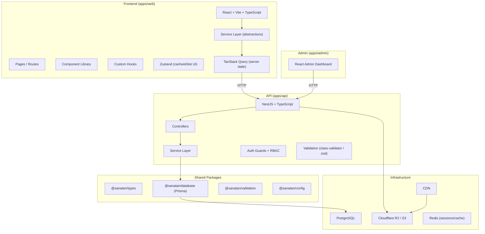
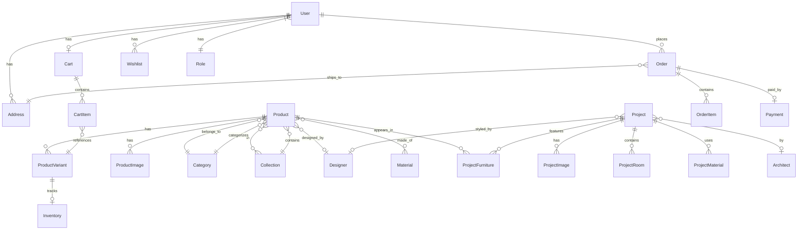
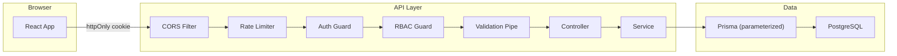
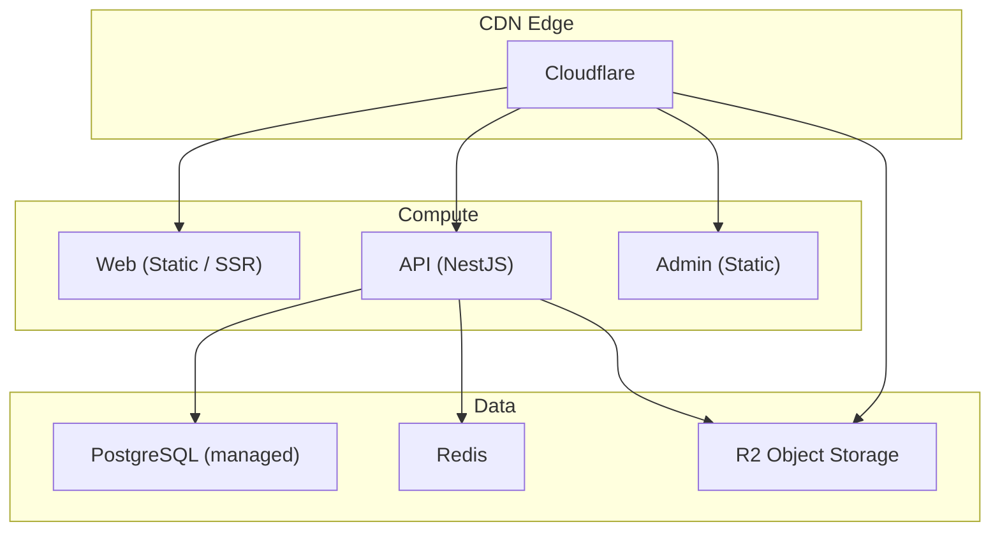

# Sanatan — Architecture Proposal

> Premium Architecture + Furniture Editorial Commerce Platform

---

## A. Proposed Architecture



### Layered Architecture

| Layer | Responsibility | Technology |
|-------|---------------|------------|
| **Presentation** | UI components, pages, layouts | React, Framer Motion, R3F |
| **Application** | Hooks, state orchestration | TanStack Query, Zustand |
| **Service (FE)** | API abstraction, data transformation | TypeScript service classes |
| **API** | HTTP endpoints, validation, auth | NestJS |
| **Domain** | Business logic, rules | NestJS services |
| **Data Access** | Database queries, transactions | Prisma |
| **Infrastructure** | DB, storage, cache, CDN | PostgreSQL, R2, Redis |

---

## B. Proposed File Structure

```
sanatan/
├── apps/
│   ├── web/                          # Main frontend (Vite + React)
│   │   ├── public/
│   │   │   ├── robots.txt
│   │   │   └── favicon.ico
│   │   ├── src/
│   │   │   ├── main.tsx
│   │   │   ├── App.tsx
│   │   │   ├── router.tsx
│   │   │   │
│   │   │   ├── assets/               # Static assets
│   │   │   │   ├── fonts/
│   │   │   │   └── images/
│   │   │   │
│   │   │   ├── styles/               # Design system
│   │   │   │   ├── tokens.css        # Design tokens (CSS custom properties)
│   │   │   │   ├── typography.css
│   │   │   │   ├── reset.css
│   │   │   │   ├── base.css
│   │   │   │   ├── utilities.css
│   │   │   │   └── breakpoints.css
│   │   │   │
│   │   │   ├── components/
│   │   │   │   ├── ui/               # Generic design system components
│   │   │   │   │   ├── Button/
│   │   │   │   │   ├── Input/
│   │   │   │   │   ├── Badge/
│   │   │   │   │   ├── Modal/
│   │   │   │   │   ├── Drawer/
│   │   │   │   │   ├── Sheet/
│   │   │   │   │   ├── Tabs/
│   │   │   │   │   ├── Card/
│   │   │   │   │   ├── Skeleton/
│   │   │   │   │   └── Image/
│   │   │   │   │
│   │   │   │   ├── architecture/     # Architecture domain components
│   │   │   │   │   ├── ProjectHero/
│   │   │   │   │   ├── ProjectGallery/
│   │   │   │   │   ├── ProjectStory/
│   │   │   │   │   ├── MaterialStory/
│   │   │   │   │   ├── FloorPlan/
│   │   │   │   │   ├── FurnitureHotspot/
│   │   │   │   │   └── ProjectFurniture/
│   │   │   │   │
│   │   │   │   ├── commerce/         # Commerce domain components
│   │   │   │   │   ├── ProductCard/
│   │   │   │   │   ├── ProductGallery/
│   │   │   │   │   ├── ProductInfo/
│   │   │   │   │   ├── ProductConfigurator/
│   │   │   │   │   ├── AddToCart/
│   │   │   │   │   ├── CartDrawer/
│   │   │   │   │   ├── Price/
│   │   │   │   │   └── ProductFilters/
│   │   │   │   │
│   │   │   │   ├── navigation/       # Navigation components
│   │   │   │   │   ├── Header/
│   │   │   │   │   ├── MobileNavigation/
│   │   │   │   │   ├── Footer/
│   │   │   │   │   └── Breadcrumbs/
│   │   │   │   │
│   │   │   │   ├── editorial/        # Editorial components
│   │   │   │   │   ├── HeroSection/
│   │   │   │   │   ├── EditorialBlock/
│   │   │   │   │   └── StorySection/
│   │   │   │   │
│   │   │   │   ├── 3d/               # Three.js components
│   │   │   │   │   ├── ModelViewer/
│   │   │   │   │   ├── ProductModel/
│   │   │   │   │   ├── Scene/
│   │   │   │   │   ├── CameraController/
│   │   │   │   │   ├── Hotspot/
│   │   │   │   │   └── MaterialSelector/
│   │   │   │   │
│   │   │   │   └── layout/           # Layout components
│   │   │   │       ├── RootLayout/
│   │   │   │       ├── PageContainer/
│   │   │   │       └── Section/
│   │   │   │
│   │   │   ├── pages/               # Route pages
│   │   │   │   ├── Home/
│   │   │   │   ├── Projects/
│   │   │   │   ├── ProjectDetail/
│   │   │   │   ├── Shop/
│   │   │   │   ├── ProductDetail/
│   │   │   │   ├── Collections/
│   │   │   │   ├── CollectionDetail/
│   │   │   │   ├── Designers/
│   │   │   │   ├── Architects/
│   │   │   │   ├── Cart/
│   │   │   │   ├── Account/
│   │   │   │   ├── Auth/
│   │   │   │   └── NotFound/
│   │   │   │
│   │   │   ├── hooks/               # Custom hooks
│   │   │   │   ├── useMediaQuery.ts
│   │   │   │   ├── useScrollProgress.ts
│   │   │   │   ├── useReducedMotion.ts
│   │   │   │   ├── useLazyLoad.ts
│   │   │   │   └── useBreakpoint.ts
│   │   │   │
│   │   │   ├── services/            # API service abstraction
│   │   │   │   ├── api.ts           # Base HTTP client
│   │   │   │   ├── projectService.ts
│   │   │   │   ├── productService.ts
│   │   │   │   ├── collectionService.ts
│   │   │   │   ├── cartService.ts
│   │   │   │   ├── authService.ts
│   │   │   │   └── designerService.ts
│   │   │   │
│   │   │   ├── store/               # Client state (Zustand)
│   │   │   │   ├── cartStore.ts
│   │   │   │   ├── wishlistStore.ts
│   │   │   │   └── uiStore.ts
│   │   │   │
│   │   │   ├── data/                # Mock data (temporary)
│   │   │   │   ├── projects.ts
│   │   │   │   ├── products.ts
│   │   │   │   ├── collections.ts
│   │   │   │   └── designers.ts
│   │   │   │
│   │   │   ├── lib/                 # Utilities
│   │   │   │   ├── cn.ts
│   │   │   │   ├── formatCurrency.ts
│   │   │   │   ├── seo.ts
│   │   │   │   └── motion.ts
│   │   │   │
│   │   │   └── types/               # Frontend-specific types
│   │   │       └── index.ts
│   │   │
│   │   ├── index.html
│   │   ├── vite.config.ts
│   │   ├── tsconfig.json
│   │   └── package.json
│   │
│   ├── api/                          # Backend (NestJS) — Phase 2+
│   │   ├── src/
│   │   │   ├── main.ts
│   │   │   ├── app.module.ts
│   │   │   └── modules/
│   │   │       ├── auth/
│   │   │       ├── users/
│   │   │       ├── products/
│   │   │       ├── categories/
│   │   │       ├── collections/
│   │   │       ├── projects/
│   │   │       ├── designers/
│   │   │       ├── architects/
│   │   │       ├── inventory/
│   │   │       ├── cart/
│   │   │       ├── orders/
│   │   │       ├── payments/
│   │   │       └── uploads/
│   │   └── package.json
│   │
│   └── admin/                        # Admin panel — Phase 3+
│       └── ...
│
├── packages/
│   ├── types/                        # Shared domain types
│   │   ├── src/
│   │   │   ├── user.ts
│   │   │   ├── product.ts
│   │   │   ├── project.ts
│   │   │   ├── collection.ts
│   │   │   ├── designer.ts
│   │   │   ├── architect.ts
│   │   │   ├── cart.ts
│   │   │   ├── order.ts
│   │   │   ├── api.ts
│   │   │   └── index.ts
│   │   ├── tsconfig.json
│   │   └── package.json
│   │
│   ├── database/                     # Prisma schema + migrations
│   │   ├── prisma/
│   │   │   └── schema.prisma
│   │   ├── seed.ts
│   │   └── package.json
│   │
│   ├── validation/                   # Shared validation schemas
│   │   ├── src/
│   │   │   ├── product.ts
│   │   │   ├── auth.ts
│   │   │   └── index.ts
│   │   └── package.json
│   │
│   └── config/                       # Shared configuration
│       ├── eslint/
│       ├── typescript/
│       └── package.json
│
├── docs/
│   ├── architecture.md
│   ├── api.md
│   ├── database.md
│   └── security.md
│
├── infra/
│   ├── docker/
│   │   ├── Dockerfile.web
│   │   ├── Dockerfile.api
│   │   └── docker-compose.yml
│   └── deployment/
│
├── .env.example
├── .eslintrc.js
├── .prettierrc
├── .gitignore
├── turbo.json                        # Turborepo config
├── package.json                      # Root workspace
├── pnpm-workspace.yaml
└── README.md
```

---

## C. Technology Choices

| Concern | Choice | Rationale |
|---------|--------|-----------|
| **Monorepo** | Turborepo + pnpm | Fast builds, shared packages, scales well |
| **Frontend** | Vite + React 18 + TypeScript | Fast DX, excellent tree-shaking, modern tooling |
| **Routing** | React Router v6 | Standard, lazy-loading routes, nested layouts |
| **Server State** | TanStack Query v5 | Caching, deduplication, stale-while-revalidate |
| **Client State** | Zustand | Minimal, no boilerplate, perfect for cart/wishlist |
| **Styling** | Vanilla CSS + CSS Custom Properties | Maximum control, no runtime cost, design tokens |
| **Animation** | Framer Motion + GSAP (selective) | Editorial feel, scroll-based animations |
| **3D** | React Three Fiber + Drei (lazy loaded) | Selective 3D without full-page WebGL |
| **Backend** | NestJS + TypeScript | Modular, enterprise-ready, guards/pipes/interceptors |
| **ORM** | Prisma | Type-safe, migrations, great DX |
| **Database** | PostgreSQL | Relational integrity, JSON support, mature |
| **Auth** | JWT + httpOnly cookies + refresh tokens | Secure, stateless, standard |
| **Storage** | Cloudflare R2 / S3-compatible | Cheap, CDN-friendly, S3-compatible API |
| **Linting** | ESLint + Prettier | Consistent code style |
| **Testing** | Vitest + Testing Library | Fast, Vite-native, component testing |

---

## D. Database Domain Model



### Key Models

| Model | Key Fields |
|-------|-----------|
| **User** | id (UUID), email (unique), passwordHash, firstName, lastName, role, createdAt, updatedAt |
| **Product** | id (UUID), slug (unique), title, description, price, currency, categoryId, designerId, status, createdAt, updatedAt |
| **ProductVariant** | id (UUID), productId, sku, material, color, dimensions, price, createdAt |
| **ProductImage** | id (UUID), productId, url, altText, sortOrder |
| **Category** | id (UUID), slug (unique), name, description, parentId |
| **Collection** | id (UUID), slug (unique), name, description, coverImage, featured |
| **Designer** | id (UUID), slug (unique), name, bio, portrait, website |
| **Architect** | id (UUID), slug (unique), name, firm, bio, portrait, website |
| **Project** | id (UUID), slug (unique), title, location, year, architectId, designerId, photographerName, description, story, coverImage, featured, status |
| **ProjectImage** | id (UUID), projectId, url, altText, caption, sortOrder |
| **ProjectRoom** | id (UUID), projectId, name, description |
| **ProjectMaterial** | id (UUID), projectId, materialId, usage |
| **ProjectFurniture** | id (UUID), projectId, productId, roomId, hotspotX, hotspotY, imageId |
| **Material** | id (UUID), slug (unique), name, description, image |
| **Inventory** | id (UUID), variantId, quantity, reserved, warehouse |
| **Cart** | id (UUID), userId, sessionId, createdAt, updatedAt |
| **CartItem** | id (UUID), cartId, variantId, quantity |
| **Order** | id (UUID), userId, status, subtotal, tax, shipping, total, addressId, createdAt |
| **OrderItem** | id (UUID), orderId, variantId, quantity, unitPrice, total |
| **Address** | id (UUID), userId, line1, line2, city, state, postalCode, country, isDefault |
| **Payment** | id (UUID), orderId, provider, providerPaymentId, status, amount, currency, createdAt |
| **Wishlist** | id (UUID), userId, productId, createdAt |
| **Review** | id (UUID), userId, productId, rating, title, body, status, createdAt |

---

## E. API Structure

### Endpoints

| Method | Endpoint | Description |
|--------|---------|-------------|
| **Projects** | | |
| GET | `/api/v1/projects` | List projects (paginated, filterable) |
| GET | `/api/v1/projects/:slug` | Get project detail |
| GET | `/api/v1/projects/:slug/furniture` | Get furniture in project |
| **Products** | | |
| GET | `/api/v1/products` | List products (paginated, filterable) |
| GET | `/api/v1/products/:slug` | Get product detail |
| GET | `/api/v1/products/:slug/projects` | Get projects featuring product |
| **Categories** | | |
| GET | `/api/v1/categories` | List categories |
| GET | `/api/v1/categories/:slug` | Get category with products |
| **Collections** | | |
| GET | `/api/v1/collections` | List collections |
| GET | `/api/v1/collections/:slug` | Get collection detail |
| **Designers** | | |
| GET | `/api/v1/designers` | List designers |
| GET | `/api/v1/designers/:slug` | Get designer profile |
| **Architects** | | |
| GET | `/api/v1/architects` | List architects |
| GET | `/api/v1/architects/:slug` | Get architect profile |
| **Cart** | | |
| GET | `/api/v1/cart` | Get current cart |
| POST | `/api/v1/cart/items` | Add item to cart |
| PATCH | `/api/v1/cart/items/:id` | Update cart item |
| DELETE | `/api/v1/cart/items/:id` | Remove cart item |
| **Orders** | | |
| POST | `/api/v1/orders` | Create order (server-validated) |
| GET | `/api/v1/orders` | List user orders |
| GET | `/api/v1/orders/:id` | Get order detail |
| **Auth** | | |
| POST | `/api/v1/auth/register` | Register |
| POST | `/api/v1/auth/login` | Login (returns httpOnly cookie) |
| POST | `/api/v1/auth/refresh` | Refresh token |
| POST | `/api/v1/auth/logout` | Logout |
| GET | `/api/v1/auth/me` | Get current user |
| **Admin** | | |
| ALL | `/api/v1/admin/*` | RBAC-protected admin endpoints |

### Response Shape

```typescript
interface ApiResponse<T> {
  data: T;
  meta?: {
    page: number;
    pageSize: number;
    total: number;
    totalPages: number;
  };
}

interface ApiError {
  statusCode: number;
  message: string;
  errors?: Record<string, string[]>;
}
```

---

## F. Security Architecture



| Layer | Protection |
|-------|-----------|
| **Transport** | HTTPS only, HSTS |
| **CORS** | Whitelist origins |
| **Rate Limiting** | Per-IP, per-user, per-endpoint |
| **Authentication** | JWT in httpOnly secure cookies, refresh tokens |
| **Authorization** | Role-based guards (ADMIN, CONTENT_EDITOR, INVENTORY_MANAGER, CUSTOMER) |
| **Input Validation** | Zod / class-validator on every endpoint |
| **SQL Injection** | Prisma parameterized queries |
| **XSS** | CSP headers, sanitized output, React auto-escaping |
| **CSRF** | SameSite cookies + CSRF tokens for mutations |
| **File Upload** | MIME validation, size limits, virus scanning |
| **Secrets** | Environment variables only, never in bundle |
| **Prices** | Server-calculated, never trusted from client |
| **Payments** | Server-side verification via provider webhooks |
| **Audit** | Logging for admin operations |

---

## G. Responsive Strategy

| Breakpoint | Target | Strategy |
|-----------|--------|----------|
| **360–430px** | Mobile (primary) | Single column, bottom nav, swipe galleries, sticky CTAs, bottom sheets |
| **768px** | Tablet | Two-column where appropriate, side navigation emerges |
| **1024px** | Small desktop | Multi-column layouts, hover interactions |
| **1440px+** | Large desktop | Full editorial layouts, richer interactions, cursor effects |

### Mobile-First Principles
- CSS written mobile-first with `min-width` media queries
- Touch targets minimum 44×44px
- Bottom navigation for primary actions
- Horizontal swipe for galleries and collections
- Sticky product actions (add to cart)
- Bottom-sheet for filters
- Responsive images with `srcset` and `sizes`
- Lazy loading below the fold

---

## H. Animation & 3D Strategy

### Animation
- **Engine**: Framer Motion (primary), GSAP + ScrollTrigger (complex scroll sequences)
- **Feel**: Slow, editorial, cinematic — 600ms–1200ms durations, ease-out curves
- **Used for**: Image reveals, page transitions, scroll storytelling, parallax, gallery transitions
- **Respects**: `prefers-reduced-motion` — all animations disabled, content fully accessible
- **Motion tokens**: Centralized duration/easing tokens in CSS and JS

### 3D
- **Engine**: React Three Fiber + Drei (lazy loaded)
- **Loading**: Dynamic imports — Three.js never loaded on pages without 3D
- **Used for**: Product model viewer, room exploration, material visualization (future)
- **Components**: Reusable abstractions in `components/3d/` with `<Suspense>` boundaries
- **Performance**: Progressive loading, LOD, compressed GLB, poster images

---

## I. Deployment Architecture



| Component | Platform Options |
|-----------|-----------------|
| **Web** | Vercel / Cloudflare Pages |
| **API** | Railway / Fly.io / AWS ECS |
| **Database** | Supabase / Neon / RDS |
| **Cache** | Upstash Redis |
| **Storage** | Cloudflare R2 |
| **CDN** | Cloudflare |
| **CI/CD** | GitHub Actions |

---

## J. Implementation Phases

### Phase 1 — Foundation (NOW)
- [x] Monorepo setup (Turborepo + pnpm)
- [x] Vite + React + TypeScript (apps/web)
- [x] Design token system (CSS custom properties)
- [x] Typography, reset, base styles
- [x] Core UI components (Button, Image, Card, Skeleton, Badge)
- [x] Layout components (RootLayout, Header, Footer, MobileNavigation)
- [x] Shared domain types (@sanatan/types)
- [x] Mock data layer (services + data files)
- [x] Router with lazy-loaded routes
- [x] Homepage — architectural hero + editorial sections
- [x] Projects listing page
- [x] Project detail page (with gallery, story, materials, furniture)
- [x] Framer Motion integration (image reveals, page transitions)
- [x] Responsive: mobile-first with all breakpoints
- [x] SEO: meta tags, semantic HTML, Open Graph
- [x] Accessibility: keyboard nav, focus states, alt text, reduced motion
- [x] ESLint + Prettier + TypeScript strict

### Phase 2 — Commerce + 3D
- Shop page with filters
- Product detail page (editorial layout)
- Product galleries
- 3D model viewer (lazy loaded R3F)
- Cart (Zustand store + drawer)
- Wishlist
- Collection pages
- Furniture hotspots on project images

### Phase 3 — Backend
- NestJS API setup
- Prisma schema + migrations
- Auth module (register/login/JWT)
- Product, Project, Collection CRUD
- Cart API (server-validated)
- Role-based access control
- File upload to R2

### Phase 4 — Admin + Orders
- Admin dashboard
- Product management
- Project management
- Order management
- Inventory management
- Content editor role

### Phase 5 — Production
- Payment integration
- Order flow
- Email notifications
- Performance optimization
- Security hardening
- Monitoring + logging
- CI/CD pipeline
- Production deployment
